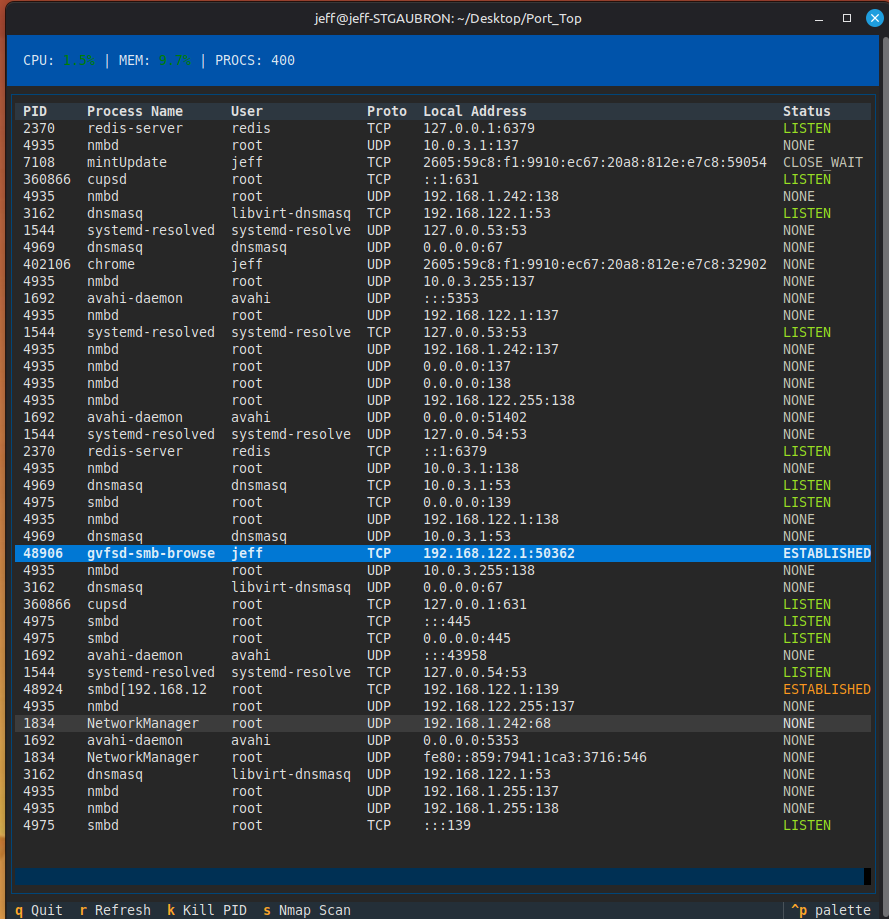

# PortTop


PortTop is a terminal-based TUI for monitoring local network ports, showing which process owns each socket, and optionally running a one-shot `nmap` scan on a selected port.

## Features
- Live dashboard for CPU, memory, and process count
- Table of TCP/UDP sockets with PID, process name, user, and status
- Quick kill: highlight a row and press `k`
- Optional `nmap` scan for a selected port (`s`)

## Safety / behavior
- PortTop does **not** scan the network automatically. It only runs `nmap` when you press `s`.
- For full visibility (system processes + killing), run with `sudo`.

## Requirements
- Python 3.8+
- `psutil`, `textual`
- `nmap` (optional, only for the scan feature)

### Install `nmap`
- Ubuntu/Debian: `sudo apt install nmap`
- macOS: `brew install nmap`
- Arch: `sudo pacman -S nmap`

## Install
```bash
python3 -m venv venv
source venv/bin/activate
pip install -r requirements.txt
```

Optional (installs the `porttop` entrypoint):
```bash
pip install -e .
```

## Usage
```bash
python port_killer.py
```

For full visibility and kill permissions:
```bash
sudo ./venv/bin/python3 port_killer.py
```

If you installed the entrypoint:
```bash
porttop
sudo porttop
```

## Screenshot
Sudo:


## Controls
| Key | Action |
| --- | ------ |
| ↑/↓ | Navigate |
| k   | Kill selected PID |
| s   | Nmap scan selected port |
| r   | Refresh table |
| q   | Quit |

## Troubleshooting
- **Permission denied** when killing a process: run with `sudo`.
- **Nmap not found**: install `nmap` (see Requirements).

## License
MIT (see `LICENSE`).
